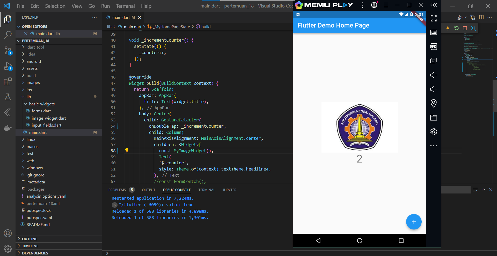
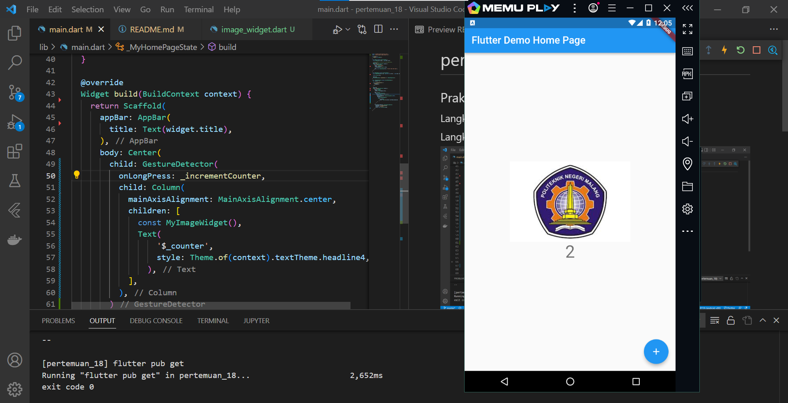
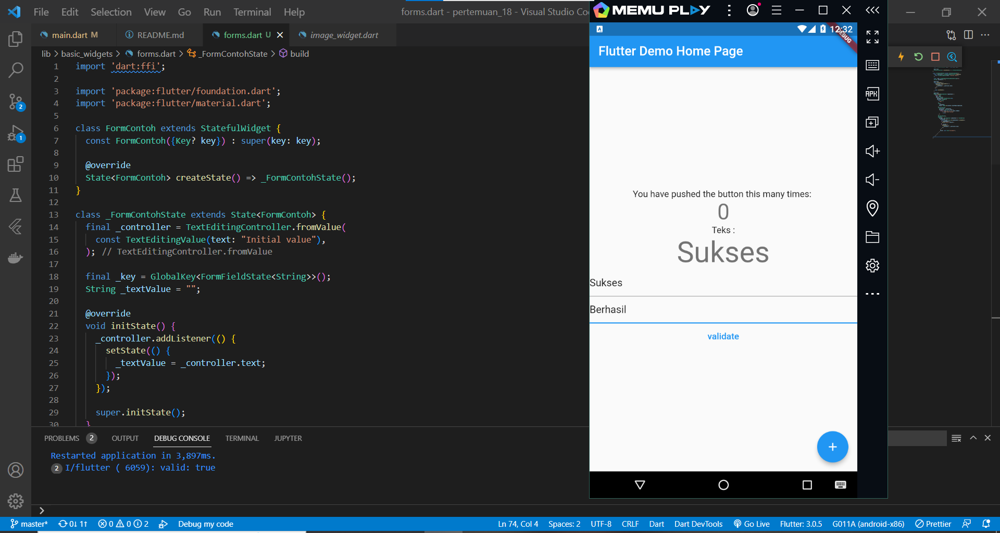
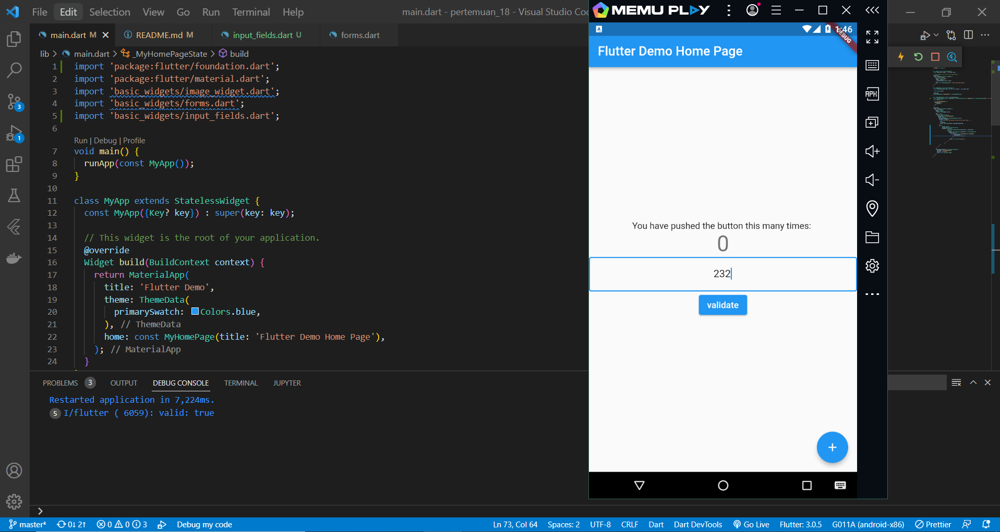

# pertemuan_18

Nama: Naily Ikmalul Insiyah

## Praktikum 1: Menerapkan Gesture Detector

### Langkah 1: Buat Project Baru
### Langkah 2: Menambahkan GestureDetector

Pada langkah ini, kita menerapkan penggunaan gesture detector berupa onTap yang berisi metod incrementCounter yang sudah dibuat sebelumnya.

### Langkah 3: Eksperimen Jenis Gesture Lain
#### 1. onDoubleTap

Saat menggunakan onDoubleTap, tampilan angka akan bertambah sesuai method incremet ketika user tap 2 kali pada bagian center.

#### 2. onLongpress

Saat menggunakan onLongpress, tampilan angka akan bertambah sesuai method incremet ketika user menekan bagian center dan menahan beberapa detik.

## Praktikum 2: Menerapkan Input Widget dan Forms
### Hasil 
Berikut output dari praktikum 2:

Pada praktikum ini kita menerapkan penggunaan textformfield yang mempunyai validasi input berupa string dan tidak boleh null. ketika input sesuai maka bisa dilihat pada debug console variabel valid bernilai true. Selain itu, juga meneapkan penggunaan controller yang di dalamnya memiliki default value untuk textformfield tersebut.

## Praktikum 3: Menerapkan Custom Input dan FormField Widget
### Hasil 
Berikut output dari praktikum 3:

Pada praktikum ini menerapkan penggunaan custom input dan FormFieldwidget. Custom input berupa request number, sehingga pada form tersebut user tidak dapat menginputkan karakter lain selain angka seperti hutuf dan simbol lainnya. ketika input sesuai maka bisa dilihat pada debug console variabel valid bernilai true.