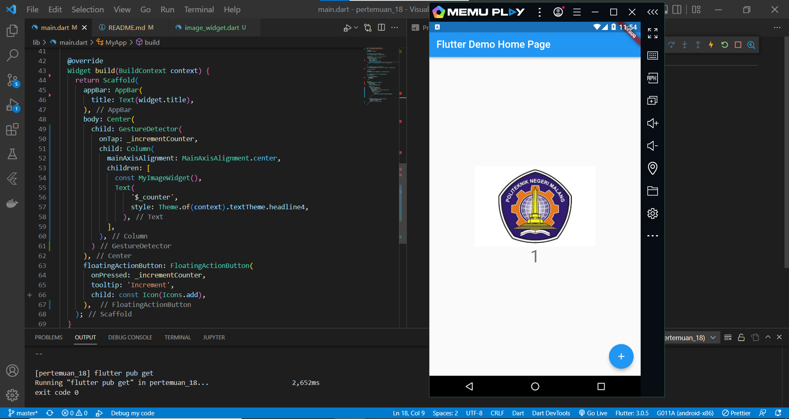

# pertemuan_18

## Praktikum 1: Menerapkan Gesture Detector

### Langkah 1: Buat Project Baru
### Langkah 2: Menambahkan GestureDetector

Pada langkah ini, kita menerapkan penggunaan gesture detector berupa onTap yang berisi metod incrementCounter yang sudah dibuat sebelumnya.

### Langkah 3: Eksperimen Jenis Gesture Lain
#### 1. onDoubleTap

Saat menggunakan onDoubleTap, tampilan angka akan bertambah sesuai method incremet ketika user tap 2 kali pada bagian center.

#### 2. onLongpress

Saat menggunakan onLongpress, tampilan angka akan bertambah sesuai method incremet ketika user menekan bagian center dan menahan beberapa detik.

